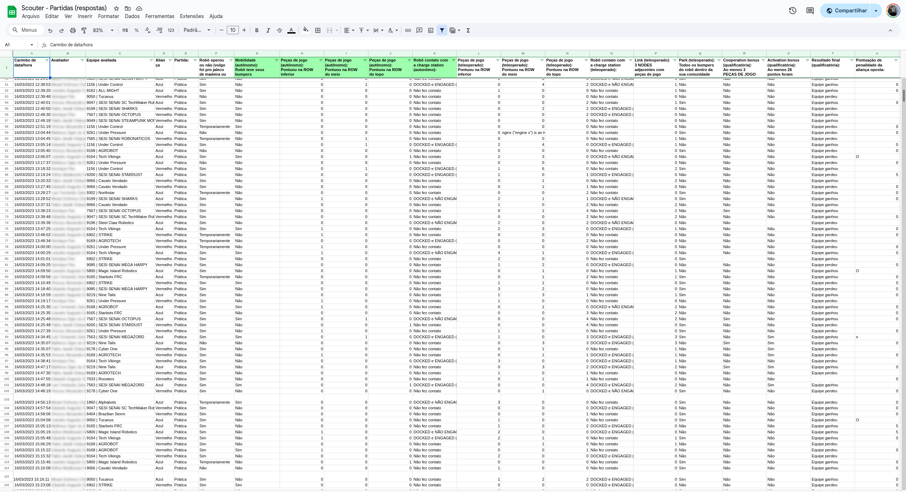
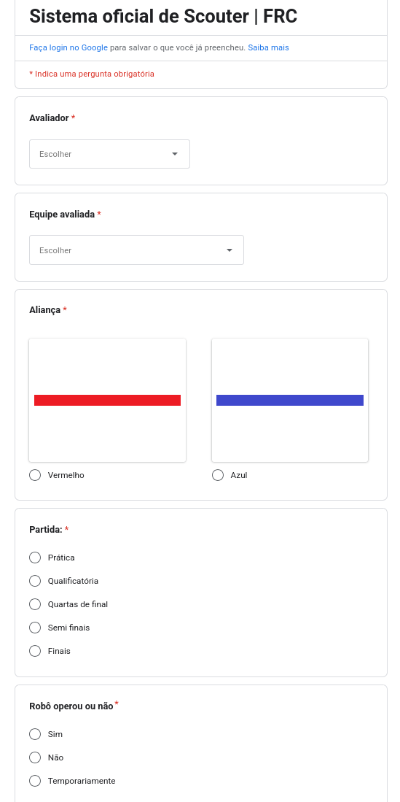
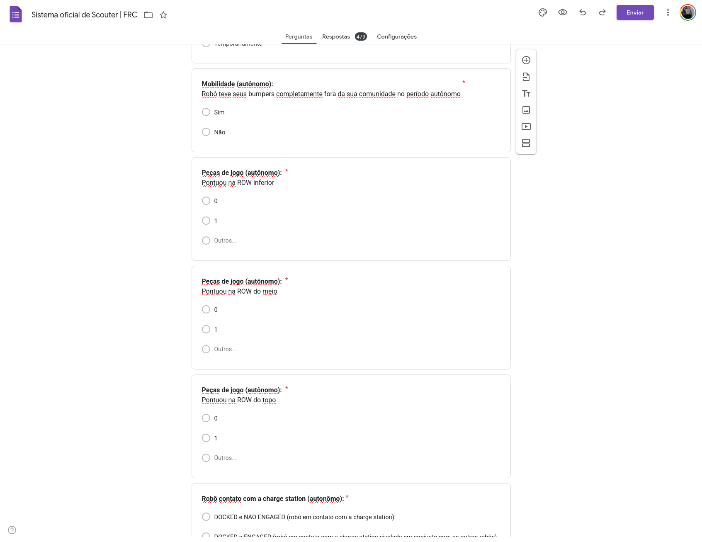
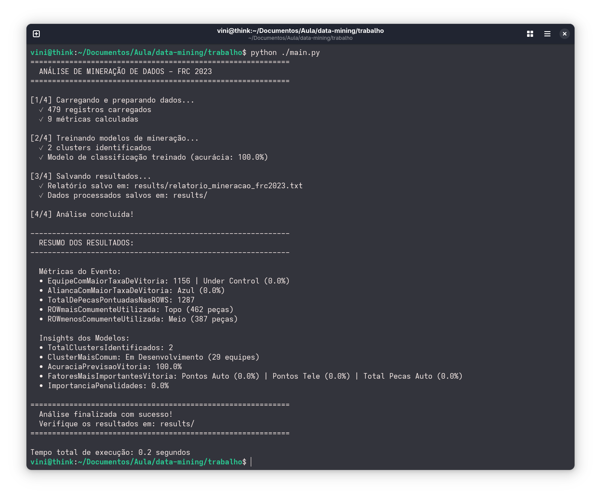

# Analisando os resultados de partidas em competições FIRST de robótica através da mineração de dados

- Escrito por [Vinícius Alexandre Lucas](mailto:103871@aluno.uricer.edu.br)

- _Link_ para o repositório: <https://github.com/viniciusalexandrelucas/trabalho-mineracao-de-dados>

## O motivo

A FIRST é uma organização sem fins lucrativos voltada ao incentivo à educação e ciência através de competições de robótica, que são realizadas em grande escala e de forma internacional, envolvendo dezenas de milhares de equipes independentes em cada edição. Após a publicação das regras da temporada, cada time tem o papel de criar o seu próprio robô sob as normas e restrições declaradas, que seja capaz de concluir os desafios defninidos utilizando uma determinada estratégia. As atividades exercidas nas arenas geralmente incluem objetivos como a movimentação de itens para áreas específicas de pontuação, coordenação autônoma de locomação através do mapeamento em tempo real, e o mais importante, o trabalho em equipe.

As partidas tem a divisão dos times em duas alianças de três equipes, sendo que esta divisão é formada previmanete para agendar diversas partidas, que usam valores pré-calculados para estimar combinações justas nos períodos iniciais, antes das eliminatórias. Consequentemente, é crucial manter uma relação de respeito e cooperação entre todos, pois uma equipe uma pode ser tanto um oponente, como um aliado em diversas partidas. Ao chegar nos períodos finais, as equipes são encarregadas mutuamente formar uma aliança fixa com outras equipes para disputar a vitória, e compreender os limites e capacidades de cada um é crucial para tomar esta decisão.

A base técnica destes eventos proporciona uma oportunidade de coleta massiva de dados de performance nas partidas, onde as equipes podem executar uma tarefa chamada de _Scouting_. Esta função coordena um grupo dedicado de membros da equipe, os _Scouters_, a observarem individualmente cada robô em cada partida com o intuito de objetivamente registrar todas as ações que estes performam. Os dados em si podem ser coletados de diversas maneiras, com a forma mais comum sendo um sistema simples de formulários _Web_ ou um aplicativo internamente desenvolvidos, que contribuem diretamente para uma base dados ou planilha unificada responsável por receber cada envio.

O resultado é um reflexo direto todos os movimentos realizados pelos times, o que proporciona um método extremamente preciso de avaliar como cada equipe age, desenvolve e atua quando em ação. A simples presença destes dados possui um grande peso e significado para entender os próprios limites, mas também colabora direcionalmente na escolha da formação das alianças. Ao processar estes valores, a informação extraída pode se tornar um fator decisivo em um cenário competitivo tão flexível e veloz.

## O _dataset_ escolhido, e a sua origem

Em 2023, o autor deste trabalho pôde de acompanhar uma destas competições junto à uma equipe local na edição realizada em Brasília, o Festival Sesi de Robótica 2023, mais especificamente na categoria "Charged Up!" da FRC (FIRST Robotics Challenge). Com o papel de orquestrar o _Scouting_, desde a coordenação dos integrantes com as orientações de uso do formulário virtual, até a visualização em reuniões feitas entre os membros no evento. 

Foram registradas no total 479 entradas em 20 colunas entre os dias 16 e 18 de março de 2023, onde estas respostas correspondem as respectivas perguntas presentes no formulário. Cada _Scouter_ recebeu o acesso a planilha contida no _Google Forms_, que possibilitou a integração direta com o sistema de planilhas do _Google Sheets_, portanto, a origem do _dataset_ em análise é de autoria própria do grupo de _Scouting_ e dos seus orientadores. A figura 1 exibe a planilha dos resultados, enquanto a figura 2 e 3 representam respectivamente o formulário usado para as respostas, e o editor gráfico do _Google Forms_ para a criação dos mesmos.







O acesso destas informações foi devidamente concedido pelos envolvidos no processo de criação deste fluxo, e os resultados da planilha foram exportados no formato CSV para o processamento, que gerou um arquivo neste contêiner de aproximadamente 100,6 _kilobytes_.

Ao considerar a estrutura que o projeto utilizou, é necessário ressaltar que três colunas serão modificadas ou desconsideradas para a entrada e tratamento dos dados:

- "Comentários adicionais" e "Descrição geral da partida", que armazenam texto puro em linguagem natural que não podem ser computadas objetivamente, portanto, serão removidas;
- "Avaliador", que armazena o nome completo dos _Scouters_ a propósito de identificação para os regsitros internos da equipe, que por razões de privacidade será anonimizada. Esta transformação será executada pela substituição progressiva dos nomes pelos números no intervalo de um a nove, em ordem alfabética.

## Processando os dados

A análise feita consiste em um projeto em Python, que recebe o _dataset_, com o objetivo de tratar e sanitizar as entradas, para processá-los e gerar relatórios em texto para a leitura dos resultados.

O código em si só precisa ter o arquivo `main.py` executado para gerar os resultados da mineração. A saída consiste em um arquivo no formato .txt, que é enviado ao diretório `/results`.

Na figura 4, é possível visualizar uma saída de pré-visualização do projeto no terminal:



Estes valores impressos indicam, usando língua natural, alguns resultados de maior importância.

## A saída bruta do processamento no arquivo

```
============================================================
  RELATÓRIO DE MINERAÇÃO DE DADOS - FRC 2023
  Gerado em: 06/07/2025 23:44:15
============================================================

------------------------------------------------------------
  MÉTRICAS GERAIS DO EVENTO
------------------------------------------------------------
  [EquipeComMaiorTaxaDeVitoria]: 1156 | Under Control (0.0%)
  [AliancaComMaiorTaxaDeVitoria]: Azul (0.0%)
  [TotalDePecasPontuadasNasROWS]: 1287
  [ROWmaisComumenteUtilizada]: Topo (462 peças)
  [ROWmenosComumenteUtilizada]: Meio (387 peças)
  [ROWmaisUtilizadaEmRelacaoAsVitorias]: Inferior (0 peças em vitórias)
  [PontuacaoAutonomoMaisAlta]: 1860 | Alphabots (6 pontos)
  [PontuacaoTeleoperadoMaisAlta]: 8276 | ETECHNOLOGY#8276 (62 pontos)
  [RelacaoChargeStationVitoria]: Com charge station: nan% (auto) / nan% (tele) | Sem: 0.0%

------------------------------------------------------------
  INSIGHTS DOS MODELOS DE MINERAÇÃO
------------------------------------------------------------
  [TotalClustersIdentificados]: 2
  [ClusterMaisComum]: Em Desenvolvimento (29 equipes)
  [AcuraciaPrevisaoVitoria]: 100.0%
  [FatoresMaisImportantesVitoria]: Pontos Auto (0.0%) | Pontos Tele (0.0%) | Total Pecas Auto (0.0%)
  [ImportanciaPenalidades]: 0.0%

============================================================
  ANÁLISE DE CLUSTERS - PERFIS DE EQUIPES
============================================================

  Cluster 0: Em Desenvolvimento
  ----------------------------------------
  • Número de equipes: 29
  • Taxa de vitória: 0.0%
  • Pontos autônomo (média): 1.2
  • Pontos teleoperado (média): 4.5
  • Total de peças (média): 1.8
  • Links pontuados (média): 0.70

  Cluster 1: Especialista Autônomo
  ----------------------------------------
  • Número de equipes: 13
  • Taxa de vitória: 0.0%
  • Pontos autônomo (média): 3.2
  • Pontos teleoperado (média): 12.3
  • Total de peças (média): 4.0
  • Links pontuados (média): 1.26
  → Forte início de partida com pontuação autônoma
============================================================
  FATORES MAIS IMPORTANTES PARA VITÓRIA
============================================================

  1. Pontuação no Autônomo
      0.0%

  2. Pontuação no Teleoperado
      0.0%

  3. Peças no Autônomo
      0.0%

  4. Peças no Teleoperado
      0.0%

  5. Links Completados
      0.0%

  6. Penalidades do Oponente
      0.0%

  7. Charge Station no Autônomo
      0.0%

  8. Charge Station no Teleoperado
      0.0%

  9. Proporção de Peças no Topo
      0.0%
============================================================
  DESEMPENHO DO MODELO DE PREVISÃO
============================================================

  Acurácia Geral: 100.0%

  Detalhamento por Classe:

  → Previsão de DERROTA:
    • Precisão: 100.0%
    • Recall: 100.0%
    • F1-Score: 100.0%
============================================================
  TOP EQUIPES POR DESEMPENHO GERAL
============================================================

  1. Equipe 7567 | SESI SENAI OCTOPUS
     • Perfil: N/A
     • Taxa de vitória: 0.0%
     • Média pontos/partida: 23.8

  2. Equipe 7563 | SESI SENAI MEGAZORD
     • Perfil: N/A
     • Taxa de vitória: 0.0%
     • Média pontos/partida: 21.7

  3. Equipe 1156 | Under Control
     • Perfil: N/A
     • Taxa de vitória: 0.0%
     • Média pontos/partida: 17.8

  4. Equipe 1860 | Alphabots
     • Perfil: N/A
     • Taxa de vitória: 0.0%
     • Média pontos/partida: 12.7

  5. Equipe 7565 | SESI SENAI ROBONATICOS
     • Perfil: N/A
     • Taxa de vitória: 0.0%
     • Média pontos/partida: 14.2

  6. Equipe 9048 | SESI/SENAI P0t1BOT (Potibot)
     • Perfil: N/A
     • Taxa de vitória: 0.0%
     • Média pontos/partida: 6.5

  7. Equipe 9047 | SESI SENAI SC TechMaker Robotics
     • Perfil: N/A
     • Taxa de vitória: 0.0%
     • Média pontos/partida: 12.8

  8. Equipe 9219 | Nine Tails
     • Perfil: N/A
     • Taxa de vitória: 0.0%
     • Média pontos/partida: 16.7

  9. Equipe 5800 | Magic Island Robotics
     • Perfil: N/A
     • Taxa de vitória: 0.0%
     • Média pontos/partida: 13.2

  10. Equipe 9164 | Tech Vikings
     • Perfil: N/A
     • Taxa de vitória: 0.0%
     • Média pontos/partida: 13.6
============================================================
  FIM DO RELATÓRIO
============================================================
```

#### Observação

Peço desculpas em razão da entrega próxima à data de envio, tentei corrigir os erros no código para os cálculos de porcentagem, porém não tive sucesso.